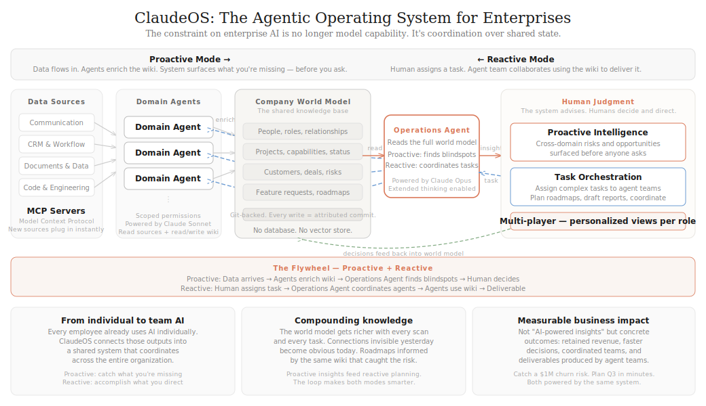

# ClaudeOS

**The agentic operating system for enterprises.**

Every team at a company already uses AI — engineers code with copilots, sales drafts with assistants, CS summarizes with chatbots. But these AI outputs are siloed. No system connects what one team's AI produces to what another team needs.

ClaudeOS changes that. It connects to a company's data sources, maintains a shared knowledge base (the company wiki), and coordinates AI agents that work both proactively and reactively — surfacing what you're missing, and delivering what you ask for.

This is a working prototype that demonstrates three capabilities with a simulated company scenario.



---

## The Company

**Meridian** — a 50-person B2B SaaS company, $8M ARR, 50 customers. They use ClaudeOS to coordinate across sales, product, and engineering.

## Three Capabilities

### 1. Proactive Intelligence — "What are you missing?"

Data flows into ClaudeOS from email, Slack, CRM, and spreadsheets. Domain agents monitor each source and update the shared wiki. The Operations Agent reads across the entire wiki and surfaces cross-cutting insights that no single person or agent could find alone.

**The demo scenario:** Three things are happening in parallel at Meridian — and nobody has connected them:
- A customer emails asking about a feature (rules-based alerting)
- An engineer posts in Slack that he built that exact feature at a hackathon — and is looking for a beta tester
- The CRM flags that same customer as at-risk, and their $1M renewal cancellation window closes today

The Operations Agent connects the dots: the feature the customer wants already exists. Ship it now and save the renewal.

**How to see it:** Log in as **Priya Sharma** (CEO) and press **Go**.

### 2. Coordinated Action — "Everyone gets their part"

When the CEO approves an action, ClaudeOS doesn't just log a decision — it cascades personalized next steps to the right people. Each team member sees a view tailored to their role, with the context they need to act.

**The demo scenario:** Priya approves "ship smart alerts to Halcyon this week." Sarah Chen (Head of Sales) immediately sees her dashboard update with specific action items: call the customer, schedule a demo, coordinate with the engineer who built the feature.

**How to see it:** After approving an action in Priya's view, click **"View [person]'s dashboard"**.

### 3. Reactive Orchestration — "Plan the Q3 roadmap"

A human assigns a complex task and the Operations Agent coordinates an agent team to deliver it. The lead agent breaks the task into subtasks, domain agents research in parallel using the wiki, they share findings with each other, and the lead synthesizes everything into a deliverable.

**The demo scenario:** Lin Zhang (Head of Product) asks ClaudeOS to plan the Q3 roadmap. Three agents work in parallel — one gathers customer feature requests, one checks engineering capacity and prototypes, one identifies at-risk accounts. Their findings flow to the Planner, which drafts a prioritized roadmap: Smart Alerts is Priority 1 (Halcyon needs it, prototype exists), Dashboard Embedding is Priority 2 (DataBridge is evaluating Tableau over this gap).

**How to see it:** Switch to **Lin Zhang** (Head of Product) and press **Plan Q3 Roadmap**.

---

## How It Works

```
Data Sources ──→ Domain Agents ──→ Company Wiki ←──→ Operations Agent ←──→ Human
     (MCP)         (Sonnet)       (git-backed)         (Opus)
```

| Component | Role |
|-----------|------|
| **Data Sources** | Email, Slack, CRM, spreadsheets — connected via MCP servers |
| **Domain Agents** | Customer Agent, Product Agent, Sales Agent — each monitors one source and updates the wiki |
| **Company Wiki** | Git-backed markdown knowledge base — the shared world model. People, projects, customers, deals, risks, roadmaps. |
| **Operations Agent** | Reads the full wiki. Proactive: finds blindspots. Reactive: coordinates agent teams for tasks. Powered by Claude Opus with extended thinking. |
| **Human Layer** | Multi-player — each person sees a role-specific view. Decisions cascade to the right people. |

**Everything is real.** The only pre-written content is the source data (simulated emails, Slack posts, etc.) and the wiki seed. All wiki updates, blindspot synthesis, agent communication, and roadmap generation are live Claude API calls.

---

## Run It Locally

### Prerequisites
- Node.js 18+
- An Anthropic API key (needs access to Claude Sonnet and Claude Opus)

### Setup

```bash
git clone https://github.com/Samagram11/claude-os.git
cd claude-os
npm install
```

Create a `.env.local` file:

```
ANTHROPIC_API_KEY=your-key-here
```

Initialize the wiki's git repo:

```bash
cd commons
git init
git add .
git commit -m "Initial seed" --author="System <system@claude-os.local>"
cd ..
```

### Run

```bash
npm run dev
```

Open [http://localhost:3000](http://localhost:3000).

### Demo Walkthrough

**Capability 1 — Proactive Intelligence:**
1. As Priya Sharma, press **Go**
2. Watch data flow in and agents update the wiki in real-time
3. The Operations Agent synthesizes a blindspot
4. Review the insight, select an action, approve

**Capability 2 — Coordinated Action:**
5. Click **"View [person]'s dashboard"** to see the personalized action plan

**Capability 3 — Reactive Orchestration:**
6. Switch to **Lin Zhang** and press **Plan Q3 Roadmap**
7. Watch the agent team coordinate — task board, agent messages, shared findings
8. Review the draft roadmap (informed by the same wiki the agents enriched)

**Explore the wiki:**
- Click **Meridian Wiki** in the nav to browse the full knowledge base
- Click any file name in the flow diagram or agent messages to open the file drawer
- Wiki pages show green "Recently updated" boxes with what agents changed

### Reset

Press **Reset** to restore the wiki to its seed state. Each run generates fresh analysis.

---

## Key Design Decisions

- **No database.** The wiki is git-tracked markdown. That IS the database.
- **No vector store / RAG.** Claude's 1M-token context reads files directly.
- **No faked outputs.** Every wiki update, blindspot, and roadmap is a live API call.
- **Agents can only update existing wiki pages** — enforces the shared-state model.
- **Git = audit trail.** Every agent write is a commit with attribution.

## Stack

- Next.js 16 (App Router), Tailwind CSS v4
- @anthropic-ai/sdk (Claude Sonnet for domain agents, Claude Opus for Operations Agent)
- simple-git (wiki version control)
- react-markdown (wiki rendering)

---

## Read More

See [memo.md](memo.md) for the full thesis on why this capability matters and how it represents a major opportunity for Anthropic.
